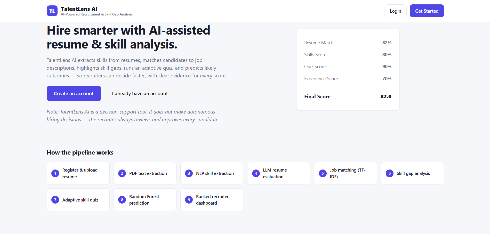
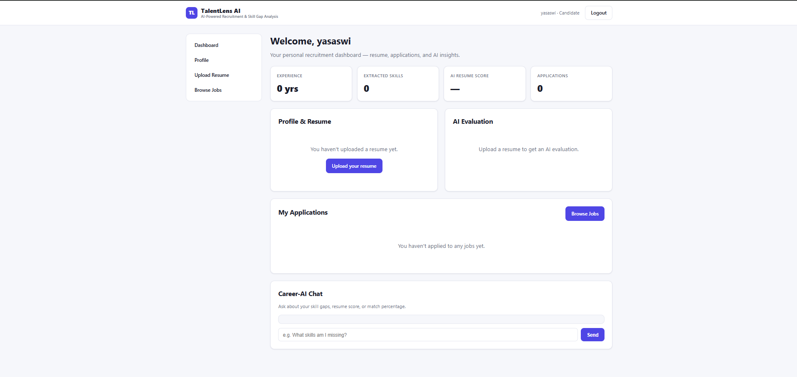

# TalentLens AI

### AI-Powered Recruitment & Skill Gap Analysis

TalentLens AI is a full-stack Flask-based recruitment decision-support platform
that analyzes resumes, extracts technical skills, matches candidates with job
descriptions, identifies skill gaps, evaluates candidates using an LLM, generates
skill-based quizzes, and provides recruiter-side candidate ranking.

## 🚀 Live Demo

[Try TalentLens AI](https://talentlens-ai-hgbr.onrender.com/)

## 💻 GitHub

[View Source Code](https://github.com/YasaswiU/talentlens-ai)

## ✨ Key Features

### Candidate
- Register and login
- Upload PDF resumes
- Automatic resume text and skill extraction
- AI-powered resume evaluation
- Job matching using TF-IDF and cosine similarity
- Skill-gap identification
- Skill-based quiz generation
- Candidate score and prediction dashboard
- Career-AI assistant

### Recruiter
- Create job postings
- View and filter candidates
- Candidate ranking
- Resume and skill-gap analysis
- Approve / Reject / Pending actions
- CSV candidate export
- ML model analytics

## 🛠️ Tech Stack

| Category | Technologies |
|---|---|
| Backend | Python, Flask |
| Frontend | HTML, CSS, JavaScript, Jinja2 |
| Database | SQLite |
| NLP | spaCy, TF-IDF |
| Machine Learning | scikit-learn, Random Forest |
| LLM | Gemma 3 4B / configured LLM service |
| Resume Parsing | pdfplumber |
| Data Processing | pandas |
| Visualization | matplotlib |

## 🏗️ Architecture

## 📸 Screenshots

### 🏠 Home Page

### 👤 Candidate Dashboard

### 👨‍💼 Recruiter Dashboard

### 📄 Resume Upload & Analysis

